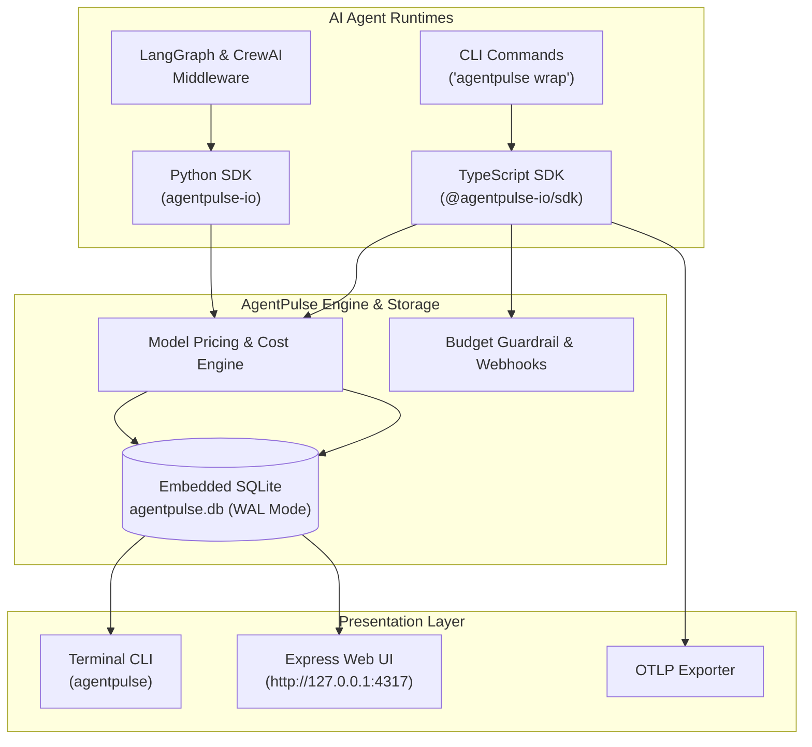

# AgentPulse ⚡

<p align="center">
  
</p>

<h3 align="center">Open-Source AI Agent Observability & Telemetry Platform</h3>
<p align="center"><b>Local-First. Zero Cloud Dependency. Privacy-Preserving SQLite Storage.</b></p>

<p align="center">
  <a href="https://github.com/nachiket0987/agentpulse"></a>
  <a href="https://linkedin.com/in/nachiket-gadilohar-profile/"></a>
  <a href="https://github.com/nachiket0987/agentpulse/actions"></a>
</p>

<p align="center">
  
  
  
  
  
  
</p>

---

## 🚀 Overview

**AgentPulse** delivers end-to-end telemetry and operational visibility into autonomous AI agents, multi-agent frameworks, and LLM execution pipelines. 

Every prompt token, completion output, tool invocation, model cost, and subagent tree execution is stored **locally on your host system** inside an embedded SQLite database (`agentpulse.db` in WAL mode). No cloud servers. No subscriptions. No data leakage.

```bash
# Trace any CLI agent in one line (zero code modification required)
agentpulse wrap claude "Write a hello world function"

# Launch local interactive web dashboard
agentpulse dashboard
# → Serving live at http://127.0.0.1:4317
```

---

## ✨ Key Features

- ⚡ **Zero-Config CLI Wrapper (`agentpulse wrap`)**: Instantly intercept and record any terminal command or CLI binary without code changes.
- 💰 **Real-Time Token & Cost Analytics**: Auto-calculates prompt and completion costs using built-in model pricing metrics (GPT-4o, Claude 3.5 Sonnet, Llama, etc.).
- 🌲 **Multi-Agent Tree Hierarchy**: Trace nested parent-child agent workflows, recursive tool executions, and step latencies.
- 🛡️ **Budget Guardrails & Alerts**: Define per-agent daily token and monetary thresholds with instant local webhook notifications on breach.
- 📊 **Local Dark Web Dashboard**: Embedded Express server serving real-time filterable UI, run logs, and trace tree drill-downs.
- 🔌 **Native SDKs & Middleware**: Drop-in support for Node.js/TypeScript, Python, CrewAI, and LangGraph.
- 📡 **OpenTelemetry (OTLP) Export**: Export trace events in standard OTLP JSON format for enterprise monitoring integrations.

---

## 🏗️ Architecture & Data Flow



---

## 📦 Setup & Installation

### 1. Global CLI Installation
```bash
npm install -g @agentpulse-io/cli

# Verify installation
agentpulse --version
```

### 2. TypeScript / Node.js SDK
```bash
npm install @agentpulse-io/sdk
```

```typescript
import { AgentPulse } from '@agentpulse-io/sdk';

const agent = new AgentPulse({ dbPath: './agentpulse.db' });
const runId = agent.startRun('research-agent');

const result = await agent.trace('search_step', async () => {
  return await performWebSearch("AgentPulse architecture");
}, {
  model: 'gpt-4o',
  tokens: { promptTokens: 120, completionTokens: 45 }
});

agent.completeRun();
agent.close();
```

### 3. Python SDK
```bash
pip install agentpulse-io
```

```python
from agentpulse import AgentPulse

agent = AgentPulse(db_path='./agentpulse.db')

with agent.trace('analysis_step') as t:
    output = run_llm_chain("Summarize research paper")
    t.set_output(output)
```

---

## 🐳 Docker Deployment

Run AgentPulse standalone using Docker:

```bash
# Pull and launch standalone container
docker run -d -p 4317:4317 -v agentpulse-data:/app/data ghcr.io/nachiket0987/agentpulse:latest

# Or launch via docker-compose
docker-compose up -d
```

---

## 📚 Project Documentation

For comprehensive design and engineering documents, see the [`docs/`](file:///c:/Users/nachi/Downloads/agenttrace-main/agenttrace-main/docs) directory:

- 📄 [Product Requirement Document (PRD)](file:///c:/Users/nachi/Downloads/agenttrace-main/agenttrace-main/docs/PRD.md)
- 📄 [Software Requirements Specification (SRS)](file:///c:/Users/nachi/Downloads/agenttrace-main/agenttrace-main/docs/SRS.md)
- 📄 [System Architecture Document](file:///c:/Users/nachi/Downloads/agenttrace-main/agenttrace-main/docs/ARCHITECTURE.md)
- 📄 [UI/UX Specification Document](file:///c:/Users/nachi/Downloads/agenttrace-main/agenttrace-main/docs/UI_UX_DESIGN.md)
- 📄 [Development Plan & Roadmap](file:///c:/Users/nachi/Downloads/agenttrace-main/agenttrace-main/docs/DEVELOPMENT_PLAN.md)

---

## 👤 Author & Contact

**Nachiket Gadilohar** — AI Engineer  
- ✉️ Email: [nachiketlohar0306@gmail.com](mailto:nachiketlohar0306@gmail.com)  
- 🐙 GitHub: [@nachiket0987](https://github.com/nachiket0987)  
- 💼 LinkedIn: [Nachiket Gadilohar Profile](https://linkedin.com/in/nachiket-gadilohar-profile/)  
