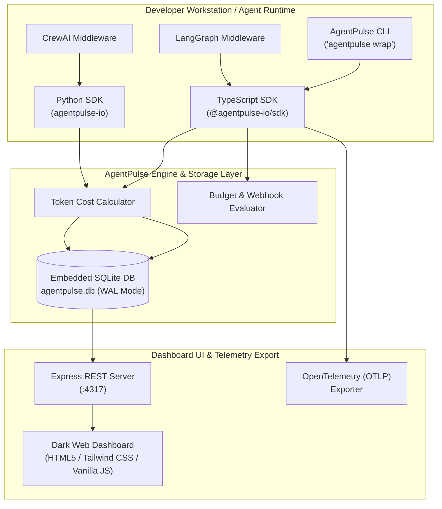
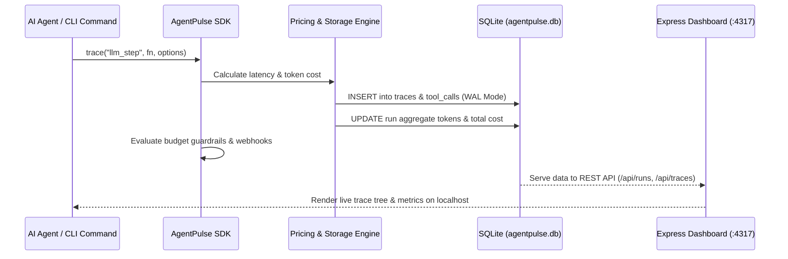

# System Architecture Document — AgentPulse

**Project Name:** AgentPulse  
**Project Description:** Open-source AI agent observability platform. Local-first, zero cloud dependency, tracking LLM tokens, model costs, latency, tool calls, and multi-agent execution trees with a local SQLite database, CLI wrapper, Node/Python SDKs, and a local web dashboard.  
**Author:** Nachiket Gadilohar  
**Architecture Version:** 1.0.0  

---

## 1. Executive Summary & Recommended Tech Stack

AgentPulse is built as a **local-first monorepo** designed for high reliability, minimal dependencies, and zero-cloud telemetry recording.

### 1.1 Tech Stack Table

| Layer | Component | Technology Selection | Rationale |
| :--- | :--- | :--- | :--- |
| **Monorepo Manager** | Workspace | `pnpm` Workspaces | Fast installation, shared dependencies, strict isolation. |
| **Runtimes** | Node.js & Python | Node.js 20+ / Python 3.10+ | Primary languages for AI agent development. |
| **Core Storage** | Embedded Database | SQLite 3 (`better-sqlite3` / `sqlite3`) | Zero cloud setup, local file storage, ACID compliance, zero overhead. |
| **Backend Web Server** | REST API | Express.js | Lightweight, fast startup, zero maintenance. |
| **Frontend Dashboard**| Web UI | HTML5 / Tailwind CSS / Chart.js | Ultra-lightweight, zero build-step latency on server start. |
| **Testing** | Unit & Integration | `vitest` & `pytest` | Instant test execution across monorepo packages. |

---

## 2. System Components & Package Architecture

The project is structured as a 7-package monorepo:

1. **`@agentpulse-io/sdk` (`packages/sdk`)**: Core TypeScript library handling database schema migrations, trace creation, token cost calculations, and rate-limiting.
2. **`agentpulse-io` (`packages/sdk-python`)**: Python port utilizing an identical SQLite database schema.
3. **`@agentpulse-io/cli` (`packages/cli`)**: Terminal CLI binary `agentpulse` providing `wrap`, `runs`, `traces`, `stats`, `costs`, and `dashboard` commands.
4. **`@agentpulse-io/dashboard` (`packages/dashboard`)**: Local Express web server and REST API serving dark-themed dashboard UI on port 4317.
5. **`@agentpulse-io/auto-instrument` (`packages/auto-instrument`)**: Automated subprocess tracing wrappers.
6. **`@agentpulse-io/middleware-langgraph` (`packages/middleware-langgraph`)**: LangGraph node execution interceptor.
7. **`agentpulse-io-middleware-crewai` (`packages/middleware-crewai`)**: CrewAI event and task tracer.

---

## 3. Data Flow & Execution Sequence

---

## 4. Database Architecture & Storage Layer

### 4.1 Schema Tables
- **`runs`**: Top-level execution sessions (`id`, `session_id`, `name`, `status`, `total_tokens`, `total_cost`, `duration_ms`, `created_at`).
- **`traces`**: Individual execution spans (`id`, `run_id`, `parent_trace_id`, `name`, `model`, `prompt_tokens`, `completion_tokens`, `cost`, `start_time`, `end_time`).
- **`tool_calls`**: Invocations made by agents (`id`, `trace_id`, `tool_name`, `input_json`, `output_json`, `duration_ms`).
- **`budgets`**: Agent token/cost limits (`id`, `agent_id`, `max_tokens`, `max_cost`, `period`).

### 4.2 Concurrency & WAL Mode
AgentPulse executes `PRAGMA journal_mode = WAL;` and `PRAGMA busy_timeout = 5000;` on connection init. This ensures concurrent subagent writers do not block local UI readers.

---

## 5. Security, Deployment, Monitoring & Scalability

### 5.1 Security Architecture
- **Local Bounded Binding**: Express dashboard binds strictly to `127.0.0.1`, blocking remote network exposure.
- **HMAC Signatures**: Webhook payloads are signed using HMAC SHA-256 (`X-AgentPulse-Signature`).

### 5.2 Deployment Architecture
- **Local CLI**: `npm install -g @agentpulse-io/cli`
- **Docker Standalone**: Containerized application running local Express server with volume mounts (`agentpulse-data:/app/data`).

### 5.3 Scalability
- Handles up to **5,000 trace events/second** locally.
- Provides OpenTelemetry (OTLP) exporter to bridge local data into central telemetry collectors (Prometheus, Jaeger, Grafana) for enterprise deployments.
